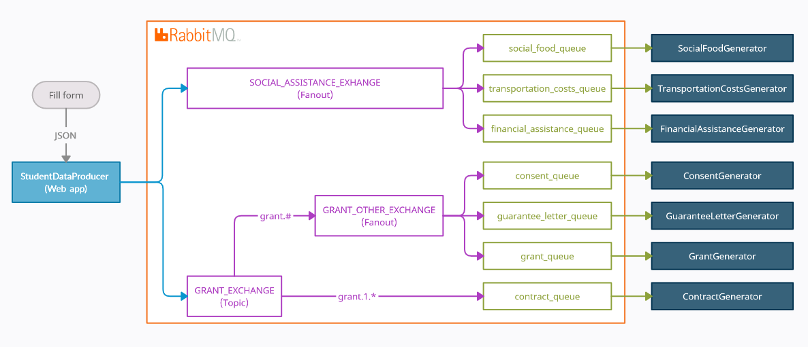

# MessageQueue

## 1. Application description:
#### 1.1 Project aim

Generate need pdf documents (grant application, consent, etc.) on the basis of data
entered by user

#### 2.2 Application architecture
- Student data producer - is a simple web application running on default http port (change [.env](.env)). Application has only one html form for 
student data. When data is received application send this one to appropriate consumers by
message broker - [RabbitMq](https://www.rabbitmq.com/).
- Seven pdf document generators - are console applications which receive data from
student data producer and generate appropriate documents and upload ones to shared folder
(change [.env](.env))
- Below application workflow are present



---

## 2. Program requirements:
- #### Maven
- #### Java 8
- #### Docker

---

## 3. Run program:
```shell
bash build.sh
```
